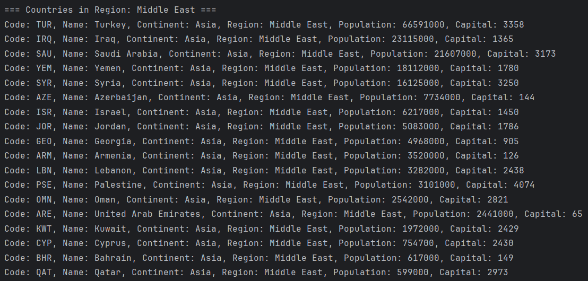
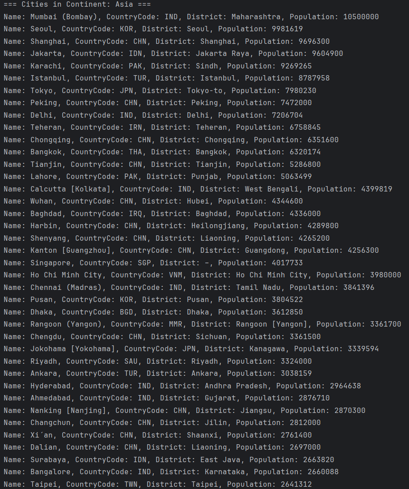
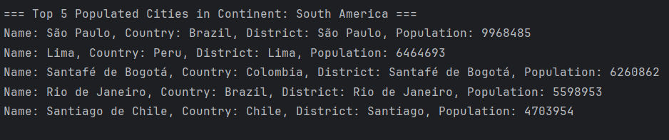

*IAAA*:
- Ismail
- Armaan
- Abdul Manan
- Abdullah

# Software Engineering Methods
* Master Build Status 
* Develop Branch Status 
* License 
* Release 

## **Requirements Implemented**
All 32 have been implemented - 100%.

---

## **Requirements Table**

| ID | Name                                                                                  | Met | Screenshot                        |
|----|---------------------------------------------------------------------------------------|-----|-----------------------------------|
| 1  | All the countries in the world organized by largest population                        | Yes |   |
| 2  | All the countries in a continent (e.g., Asia) organized by largest population         | Yes |   |
| 3  | All the countries in a region (e.g., Middle East) organized by largest population     | Yes |   |
| 4  | Top N populated countries globally                                                    | Yes |   |
| 5  | Top N populated countries in a continent (e.g., Asia)                                 | Yes |   |
| 6  | Top N populated countries in a region (e.g., Middle East)                             | Yes |   |
| 7  | All cities in the world organized by largest population                               | Yes |   |
| 8  | All cities in a continent (e.g., Asia) organized by largest population                | Yes |   |
| 9  | All cities in a region (e.g., Middle East) organized by largest population            | Yes |   |
| 10 | All cities in a country (e.g., Syria) organized by largest population                 | Yes |  |
| 11 | All cities in a district (e.g., Dubai) organized by largest population                | Yes |  |
| 12 | Top N populated cities globally                                                       | Yes |  |
| 13 | Top N populated cities in a continent (e.g., South America)                           | Yes |  |
| 14 | Top N populated cities in a region (e.g., Caribbean)                                  | Yes |  |
| 15 | Top N populated cities in a country (e.g., Austria)                                   | Yes |  |
| 16 | Top N populated cities in a district (e.g., Noord-Brabant)                            | Yes |  |
| 17 | All capital cities in the world organized by largest population                       | Yes |  |
| 18 | All capital cities in a continent (e.g., Asia) organized by largest population        | Yes |  |
| 19 | All capital cities in a region (e.g., Western Europe) organized by largest population | Yes |  |
| 20 | Top N populated capital cities globally                                               | Yes |  |
| 21 | Top N populated capital cities in a continent (e.g., Africa)                          | Yes |  |
| 22 | Top N populated capital cities in a region (e.g., Polynesia)                          | Yes |  |
| 23 | Population of each continent                                                          | Yes |  |
| 24 | Population of each region                                                             | Yes |  |
| 25 | Population of each country                                                            | Yes |  |
| 26 | World population                                                                      | Yes |  |
| 27 | Population of a specific continent (e.g., Oceania)                                    | Yes |  |
| 28 | Population of a specific region (e.g., Micronesia)                                    | Yes |  |
| 29 | Population of a specific country (e.g., Bhutan)                                       | Yes |  |
| 30 | Population of a specific district (e.g., Utrecht)                                     | Yes |  |
| 31 | Population of a specific city (e.g., Tokyo)                                           | Yes |  |
| 32 | Language speakers report                                                              | Yes |  |

| Matriculation Number | Code Review 1 | Code Review 2 | Code Review 3 | Code Review 4 |
|----------------------|---------------|---------------|---------------|---------------|
| 40653006             | 40%           | 25%           | 55%           | 40%           |
| 40691011             | 20%           | 35%           | 25%           | 40%           |
| 40692321             | 20%           | 20%           | 10%           | 10%           |
| 40634582             | 20%           | 20%           | 10%           | 10%           |

